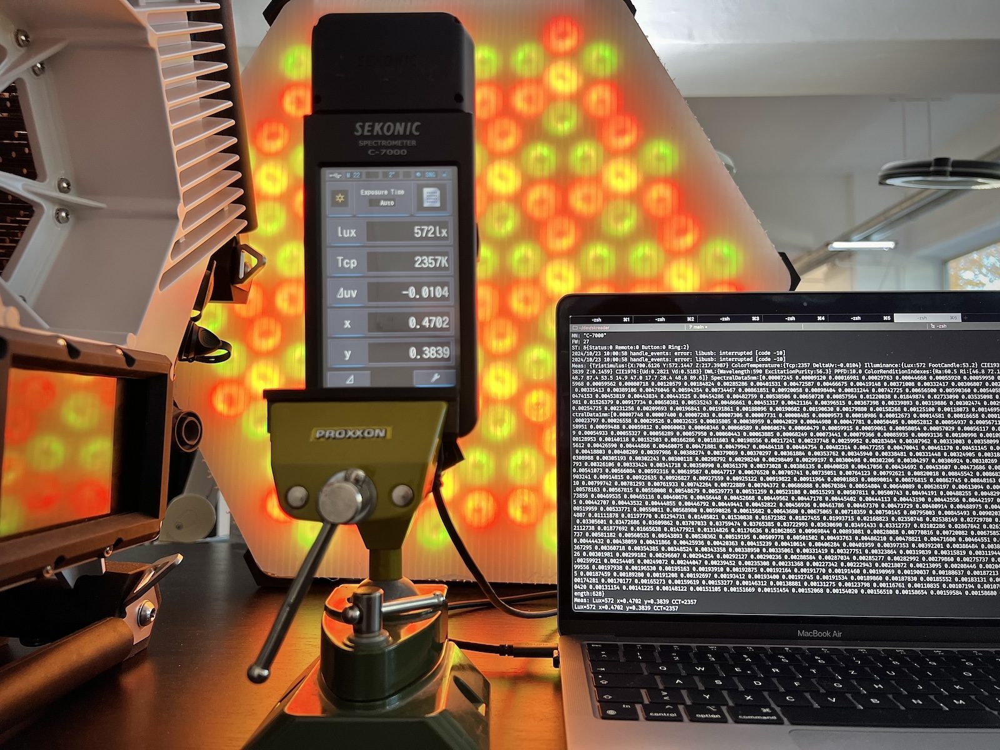

# skreader

[](https://github.com/akares/skreader/actions/workflows/test.yml) [](https://github.com/akares/skreader/actions/workflows/lint.yml)

Golang library and example command line tool for SEKONIC spectrometers remote control.

Based on original C# SDK for Windows from SEKONIC.



## Supported (tested) models

-   Sekonic C-700
-   Sekonic C-800
-   Sekonic C-800-U (US Version. Basically the same as C-800)
-   Sekonic C-7000 (supports extended measurement configuration: FOV and Exposure Time)

## Supported (tested) platforms

-   Darwin
-   Windows
-   Linux

## Known limitations

Currently **only ambient** measuring mode is supported.

TM-30, SSI and TLCI measurements are available for Sekonic C-7000 with FW version > 25 but parsing of these fields is **not implemented yet**.

## Usage

### Install USB driver

Default implementation uses [gousb](https://github.com/google/gousb) wrapper for the libusb library.

You must have [libusb-1.0](https://github.com/libusb/libusb/wiki) installed on your target system to be able to communicate with USB devices.

Installation for different platforms is covered in
[gousb documentation](https://github.com/google/gousb/blob/master/README.md#dependencies).

_If you use Linux, you probably already have it._
_If you use Mac ot Windows and was using USB devices that needed custom driver, you also probably have it._

_Alternatively_ you can provide custom USB implementation with [simple interface](usbadapter.go) close to io.Reader. See the default [gousb based implementation](gousb_adapter.go) for reference.

### Install Go

You need `Go` programming language to be installed first.

See the Go's [Download and install](https://go.dev/doc/install) page for installation instructions for different OS.

On MacOS just use [Homebrew](https://brew.sh/):

```
homebrew install go
```

### Run example measurement program usung Go

1. Connect your device.

2. Run commands below:

```
go run ./cmd/skread -run -all
```

```
go run ./cmd/skread -help
```

_Go will take care of dependencies when running this script for the first time._

### Build standalone program executable (if needed)

```
go build ./cmd/skread
```

_This will create binary executable file named `skread` in the same directory._

Run the executable:

```
./skread -help
```

_Now you can run this file on any other machine with the same OS and architecture as the one you built it with. But remeber about USB driver dependency mentioned earlier, it is needed for program to run._

### Create your own measurement program (if needed)

Note: the [cmd/skread/main.go](cmd/skread/main.go) is just an example of the library usage. If more specific funtionality is needed, you always can create your own Go program and import the library in the same way as example does. Go will fetch it automatically.

Example:

1. Create your project dir:

```
mkdir my_skreader && cd my_skreader
```

2. Initialise Go module named `my_skreader` and add `skreader` library as an external dependency:

```
go mod init my_skreader
go get github.com/akares/skreader
```

3. Download `main.go` example file there (or create manually):

```
curl -OL https://raw.githubusercontent.com/akares/skreader/main/cmd/skread/main.go
```

4. Run:

```
go run . -help
```

5. _Modify the program according to your needs._

6. Build standalone executable (if needed):

```
go build -o my_skreader ./main.go
./my_skreader -help
```

_You will still need to take care of the USB driver dependency mentioned earlier._

## Library API

See the [skread](cmd/skread/main.go) command implementation for details.

## Contribution

1. Use `gofmt`
2. Ensure unit tests are okay: `go test ./...`
3. Ensure Go linter finds no errors: `golangci-lint run .`

## License

This project is licensed under the terms of the MIT license.

## Legal notices

All product names, logos, and brands are property of their respective owners. All company, product and service names used in this package are for identification purposes only. Use of these names, logos, and brands does not imply endorsement.

-   SEKONIC is a registered trademark of SEKONIC CORPORATION.
-   Google is a registered trademark of Google LLC.
-   Windows is a registered trademark of Microsoft Corporation.
-   Linux is the registered trademark of Linus Torvalds.
